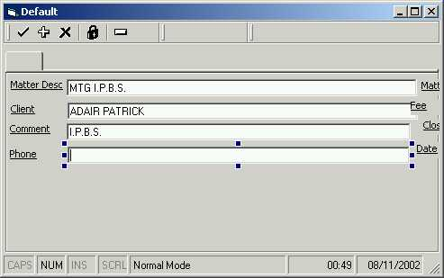

<div align="center">

## TiResize Update2


</div>

### Description

Give Runtime IDE Control ReSize Functionality.

ActiveX control attaches to any control. Provide Size and Move with anchor points with a single line of code. Provides Font Dialog Via right Click.
 
### More Info
 
set TiResize.ResizeControl = Control

set TiResize.ResizeControl = Nothing

Usercontrols do not react to the API commands so I have included a hack. You will have to include in a case list any usercontrols where typename ="UserControlName". I have been banging my head against this one and the solution will have to do until someone can tell me better.

Please list any faults. The custom control refuses to display on the same form that has a common dialog?


<span>             |<span>
---                |---
**Submitted On**   |2002-11-08 19:56:28
**By**             |[Stuart Naylor](https://github.com/Planet-Source-Code/PSCIndex/blob/master/ByAuthor/stuart-naylor.md)
**Level**          |Advanced
**User Rating**    |4.8 (19 globes from 4 users)
**Compatibility**  |VB 5\.0, VB 6\.0
**Category**       |[Custom Controls/ Forms/  Menus](https://github.com/Planet-Source-Code/PSCIndex/blob/master/ByCategory/custom-controls-forms-menus__1-4.md)
**World**          |[Visual Basic](https://github.com/Planet-Source-Code/PSCIndex/blob/master/ByWorld/visual-basic.md)
**Archive File**   |[TiResize\_U1494431192002\.zip](https://github.com/Planet-Source-Code/stuart-naylor-tiresize-update2__1-40476/archive/master.zip)

### API Declarations

```
Public Declare Function PostMessage Lib "user32" Alias "PostMessageA" (ByVal hWnd As Long, ByVal wMsg As Long, ByVal wParam As Long, ByVal lParam As Long) As Long
Public Declare Function ReleaseCapture Lib "user32" () As Long
Public Declare Function SendMessage Lib "user32" Alias "SendMessageA" (ByVal hWnd As Long, _
 ByVal wMsg As Long, ByVal wParam As Long, lParam As Any) As Long
 'API Declarations used for subclassing.
 Public Declare Sub CopyMemory _
  Lib "kernel32" Alias "RtlMoveMemory" _
  (pDest As Any, _
  pSrc As Any, _
  ByVal ByteLen As Long)
 Public Declare Function SetWindowLong _
  Lib "user32" Alias "SetWindowLongA" _
  (ByVal hWnd As Long, _
  ByVal nIndex As Long, _
  ByVal dwNewLong As Long) As Long
 Public Declare Function GetWindowLong _
  Lib "user32" Alias "GetWindowLongA" _
  (ByVal hWnd As Long, _
  ByVal nIndex As Long) As Long
 Public Declare Function CallWindowProc _
  Lib "user32" Alias "CallWindowProcA" _
  (ByVal lpPrevWndFunc As Long, _
  ByVal hWnd As Long, _
  ByVal Msg As Long, _
  ByVal wParam As Long, _
  ByVal lParam As Long) As Long
 Public Declare Function ChildWindowFromPoint _
  Lib "user32" (ByVal hWnd As Long, ByVal xPoint As Long, _
  ByVal yPoint As Long) As Long
' You can find more o these (lower) in the API Viewer. Here
' they are used only for resizing the left and right
Public Const HTCLIENT = 1
Public Const HTCAPTION = 2
Public Const HTSYSMENU = 3
Public Const HTGROWBOX = 4
Public Const HTMENU = 5
Public Const HTHSCROLL = 6
Public Const HTVSCROLL = 7
Public Const HTMINBUTTON = 8
Public Const HTMAXBUTTON = 9
Public Const HTLEFT = 10
Public Const HTRIGHT = 11
Public Const HTTOP = 12
Public Const HTTOPLEFT = 13
Public Const HTTOPRIGHT = 14
Public Const HTBOTTOM = 15
Public Const HTBOTTOMLEFT = 16
Public Const HTBOTTOMRIGHT = 17
Public Const HTBORDER = 18
Public Const WM_NCLBUTTONDOWN = &HA1
Public Const WM_SYSCOMMAND = &H112
Public Const SC_MOVE = &HF010&
Public Const SC_SIZE = &HF000&
Public Const WM_SIZING = &H214
'This message is fired whilst the window is being resized. The lParam of the message points to a RECT structure containing the desired position of the window. Any modifications you make to this rectangle are passed back to Windows, which moves or sizes the window directly to the size and position you specify.
Public Const WM_MOVING = &H216
'This message works the same way as WM_SIZING except it is fired whilst the window is being moved.
Public Const WM_ENTERSIZEMOVE = &H231
'This message is fired when your window is about to start moving or sizing.
Public Const WM_EXITSIZEMOVE = &H232
'This message is fired when a moving or sizing operation on your window has completed.
Public Const WM_SIZE = &H5
'This message is fired whenever your window has its size changed by the SetWindowPos function, for example when windows minimizes, maximizes or restores your window, or when you call a VB function which changes the size of the window.
'The sample application shows how you can subclass these messages for a window and respond correctly to them, providing the following new
Public Const WM_MOVE = &H3
 'Constants for GetWindowLong() and SetWindowLong() APIs.
 Public Const GWL_WNDPROC = (-4)
 Public Const GWL_USERDATA = (-21)
 Public Const WM_MENUSELECT = &H11F
 Public Const WM_PARENTNOTIFY = &H210
 Public Const WM_MOUSEACTIVATE = &H21
 Public Const WM_NOTIFY As Long = &H4E&
 Public Const WM_HSCROLL = &H114
 Public Const WM_VSCROLL = &H115
 Public Const NM_RCLICK = -5
 Public Const WM_LBUTTONDBLCLK = &H203
 Public Const WM_LBUTTONDOWN = &H201
 Public Const WM_LBUTTONUP = &H202
 Public Const WM_MBUTTONDBLCLK = &H209
 Public Const WM_MBUTTONDOWN = &H207
 Public Const WM_MBUTTONUP = &H208
 Public Const WM_RBUTTONDBLCLK = &H206
 Public Const WM_RBUTTONDOWN = &H204
 Public Const WM_RBUTTONUP = &H205
 Public Const WM_MOUSEFIRST = &H200
 Public Const WM_PAINT = &HF
 Public Const WM_COMMAND = &H111
Public Const WM_SETCURSOR = &H20
Public Const WM_SETFOCUS = &H7
Public Const WM_SETHOTKEY = &H32
Public Const WM_SETREDRAW = &HB
Public Const WM_SETTEXT = &HC
Public Const WM_SHOWWINDOW = &H18
Public Const WM_WINDOWPOSCHANGED = &H47
Public Const WM_WINDOWPOSCHANGING = &H46
Public Const WM_CHILDACTIVATE = &H22
Public Const WM_NCCALCSIZE = &H83
Public Const WM_NCCREATE = &H81
Public Const WM_NCDESTROY = &H82
Public Const WM_NCHITTEST = &H84
Public Const WM_NCACTIVATE = &H86
Public Const WM_NCLBUTTONUP = &HA2
Public Const WM_NCMBUTTONDOWN = &HA7
Public Const WM_NCMOUSEMOVE = &HA0
Public Const WM_NCPAINT = &H85
Public Const WM_NCRBUTTONDOWN = &HA4
```


